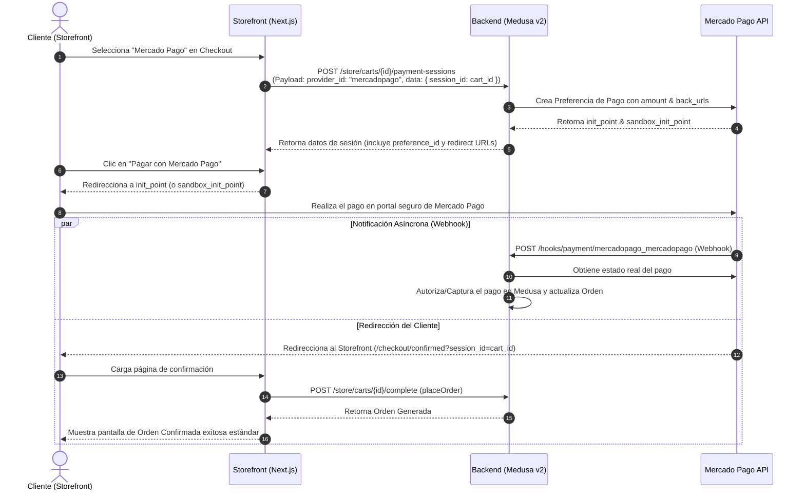

# Requerimientos de Integración del Storefront para Mercado Pago Checkout Pro (Medusa v2)

Este documento detalla todas las especificaciones y modificaciones técnicas requeridas en el storefront de Next.js (`eme-sport-wear`) para habilitar la experiencia completa de **Mercado Pago Checkout Pro (Redirect Flow)** de forma nativa e integrada con la configuración del backend de Medusa v2.

---

## 1. Arquitectura y Flujo de Cobro

En un flujo **Checkout Pro (Redirect)**, la experiencia de pago se delega por completo a la pasarela de Mercado Pago de la siguiente manera:



---

## 2. Variables de Entorno del Storefront

Configura las siguientes variables de entorno en el archivo `.env` o `.env.local` de tu storefront (`eme-sport-wear`):

```env
# URL del backend de Medusa v2
NEXT_PUBLIC_MEDUSA_BACKEND_URL=http://localhost:9000

# Bandera para determinar si se usa el sandbox o producción de Mercado Pago
# true: usa sandbox_init_point (Credenciales de Prueba)
# false: usa init_point (Credenciales de Producción)
NEXT_PUBLIC_MERCADOPAGO_SANDBOX=true
```

---

## 3. Modificaciones en el Checkout (React/Next.js)

### Paso A: Inicialización de la Sesión de Pago (`usePayment.ts`)
Ubicación: `src/features/checkout/hooks/use-payment.ts`

El backend custom de Mercado Pago requiere obligatoriamente que se envíe el `session_id` (que es el ID del carrito) al iniciar la sesión de pago, ya que es mapeado como `external_reference` en Mercado Pago y sirve para la verificación de firmas criptográficas.

Modifica la función `setPaymentMethodHandler` para que pase el `session_id` dentro del objeto `data`:

```typescript
// src/features/checkout/hooks/use-payment.ts

const setPaymentMethodHandler = async (method: string) => {
  setError(null)
  setSelectedPaymentMethod(method)
  
  if (
    isStripeFunc(method) ||
    isMercadopago(method) ||
    isContraEntrega(method)
  ) {
    // Si es Mercado Pago, enviamos el session_id requerido por el backend
    const sessionData = isMercadopago(method) 
      ? { session_id: cart.id } 
      : {};

    await initiatePaymentSession(cart, {
      provider_id: method,
      data: sessionData, // <-- CRÍTICO: Envía el cart.id como session_id
    }).catch(() => {
      setError(
        "Error al iniciar la sesión de pago. Por favor intenta nuevamente."
      )
    })
  }
}
```

> [!NOTE]
> También asegúrate de actualizar la validación en la acción `handleSubmit` para que realice lo mismo si no hay una sesión activa con el método de pago seleccionado.

---

### Paso B: Limpieza de la UI del Paso de Pago (`payment-view.tsx`)
Ubicación: `src/features/checkout/ui/payment-view.tsx`

Dado que Checkout Pro es un flujo de **redirección externa**, no es necesario renderizar ningún formulario de tarjeta de crédito (Bricks) en tu storefront. Esto optimiza drásticamente el tiempo de carga y simplifica la experiencia de usuario.

1. **Elimina** la renderización del componente `<MpPaymentBrick>` y la importación de `@mercadopago/sdk-react`.
2. **Reemplázalo** con un mensaje estático moderno y descriptivo:

```tsx
// src/features/checkout/ui/payment-view.tsx

{/* Mercado Pago Checkout Pro Panel */}
{isMp && (
  <div className="flex flex-col gap-y-3 bg-neutral-50 border border-neutral-200 rounded-lg p-5">
    <div className="flex items-center gap-x-2">
      <span className="w-2.5 h-2.5 rounded-full bg-blue-500 animate-pulse" />
      <h4 className="text-sm font-semibold text-neutral-800">Mercado Pago (Checkout Pro)</h4>
    </div>
    <p className="text-xs text-neutral-600 leading-relaxed">
      Al hacer clic en <strong>"Pagar con Mercado Pago"</strong> en el último paso, serás redirigido de forma 100% segura para completar tu compra. Podrás pagar usando tarjetas de crédito, débito, PSE, Efecty u otros medios locales disponibles.
    </p>
  </div>
)}
```

---

### Paso C: Redirección en el Botón de Pago (`payment-button/index.tsx`)
Ubicación: `src/modules/checkout/components/payment-button/index.tsx`

Cuando el cliente hace clic en el botón de realizar pedido, el storefront debe leer la sesión activa de pago de Mercado Pago, extraer la URL de redirección adecuada (producción o sandbox) y redirigir el navegador.

Reemplaza por completo el componente `MercadopagoPaymentButton` en `payment-button/index.tsx` por el siguiente código simplificado:

```tsx
// src/modules/checkout/components/payment-button/index.tsx

const MercadopagoPaymentButton = ({
  cart,
  notReady,
  "data-testid": dataTestId,
}: {
  cart: HttpTypes.StoreCart
  notReady: boolean
  "data-testid"?: string
}) => {
  const [submitting, setSubmitting] = useState(false)
  const [errorMessage, setErrorMessage] = useState<string | null>(null)

  // 1. Obtener la sesión de pago activa correspondiente a Mercado Pago
  const session = cart.payment_collection?.payment_sessions?.find(
    (s) => s.provider_id === "mercadopago" || s.provider_id.startsWith("pp_mercadopago")
  )

  const handlePayment = async () => {
    setSubmitting(true)
    setErrorMessage(null)

    if (!cart || !session) {
      setErrorMessage("No se encontró una sesión de pago activa para Mercado Pago.")
      setSubmitting(false)
      return
    }

    try {
      // 2. Extraer las URLs de redirección guardadas en la sesión desde el Backend
      const { init_point, sandbox_init_point } = session.data as {
        init_point?: string
        sandbox_init_point?: string
      }

      const isSandbox = process.env.NEXT_PUBLIC_MERCADOPAGO_SANDBOX === "true"
      const redirectUrl = isSandbox ? sandbox_init_point : init_point

      if (!redirectUrl) {
        throw new Error("No se pudo obtener la URL de redirección del servidor de pago.")
      }

      // 3. Realizar la redirección directa del navegador
      window.location.href = redirectUrl
    } catch (e: unknown) {
      setErrorMessage(e instanceof Error ? e.message : "Error al inicializar la pasarela.")
      setSubmitting(false)
    }
  }

  return (
    <>
      <Button
        disabled={notReady}
        onClick={handlePayment}
        className="w-full"
        size="large"
        isLoading={submitting}
        data-testid={dataTestId}
      >
        Pagar con Mercado Pago
      </Button>
      {errorMessage && (
        <ErrorMessage
          error={errorMessage}
          data-testid="mercadopago-payment-error-message"
        />
      )}
    </>
  )
}
```

---

## 4. Nuevas Rutas de Retorno (Next.js App Router)

El backend de Mercado Pago redirigirá al cliente de vuelta al storefront a través de rutas específicas sin el prefijo del país. La ventaja es que el middleware/proxy de redirección de Next.js (`src/proxy.ts`) las interceptará automáticamente y les inyectará el código del país correspondiente (ej: `/co/checkout/confirmed`).

Crea las siguientes tres páginas en el storefront dentro del grupo de rutas del checkout:

### A. Página de Confirmación y Éxito
Ruta: `src/app/[countryCode]/(checkout)/checkout/confirmed/page.tsx`

> [!IMPORTANT]
> **Estrategia Anti-Race-Conditions (Crucial):**
> Dado que Mercado Pago envía las notificaciones asíncronas vía Webhook al backend en paralelo con el retorno del cliente, puede ocurrir que la orden *ya haya sido creada e integrada* antes de que cargue esta página. Si se intenta completar el carrito nuevamente (`placeOrder`), Medusa arrojará un error de carrito no encontrado. 
> Esta página está optimizada para verificar de forma segura si la orden ya existe antes de disparar la finalización.

```tsx
import { placeOrder } from "@lib/data/cart"
import { sdk } from "@lib/config"
import { removeCartId } from "@lib/data/cookies"
import { redirect } from "next/navigation"

type Props = {
  searchParams: Promise<{
    session_id?: string
  }>
}

export default async function CheckoutConfirmedPage({ searchParams }: Props) {
  const { session_id } = await searchParams

  if (!session_id) {
    redirect("/")
  }

  // 1. Validar si ya existe una orden activa asociada a este id de carrito (Race Condition Handler)
  try {
    const { orders } = await sdk.store.order.list({
      cart_id: session_id
    })

    if (orders && orders.length > 0) {
      const order = orders[0]
      const countryCode = order.shipping_address?.country_code?.toLowerCase() || "co"
      await removeCartId()
      redirect(`/${countryCode}/order/${order.id}/confirmed`)
    }
  } catch (error) {
    console.error("Error al buscar orden existente por cart_id:", error)
  }

  // 2. Si no se ha creado la orden por el Webhook aún, completamos el carrito manualmente
  try {
    await placeOrder(session_id)
  } catch (error) {
    console.error("Error al completar el pedido en confirmed page:", error)
    
    // Doble verificación: en caso de que se haya completado justo durante la llamada a placeOrder
    try {
      const { orders: retryOrders } = await sdk.store.order.list({
        cart_id: session_id
      })

      if (retryOrders && retryOrders.length > 0) {
        const order = retryOrders[0]
        const countryCode = order.shipping_address?.country_code?.toLowerCase() || "co"
        await removeCartId()
        redirect(`/${countryCode}/order/${order.id}/confirmed`)
      }
    } catch (retryError) {
      console.error("Error en re-verificación de orden:", retryError)
    }

    // Si todo falla y la orden no se procesó
    return (
      <div className="flex flex-col items-center justify-center min-h-[60vh] p-6 text-center max-w-xl mx-auto">
        <div className="w-16 h-16 bg-red-100 rounded-full flex items-center justify-center text-red-600 mb-4 text-2xl font-bold">
          ✕
        </div>
        <h1 className="text-2xl font-bold text-neutral-800 mb-2">Inconveniente al Registrar el Pedido</h1>
        <p className="text-neutral-600 mb-6 text-sm">
          Mercado Pago procesó tu pago correctamente, pero tuvimos un retraso en la sincronización con el sistema de inventarios. No te preocupes, el cobro ya fue registrado y nuestro soporte lo validará de inmediato.
        </p>
        <div className="flex gap-x-4">
          <a href="/" className="px-6 py-3 bg-black text-white rounded-md text-sm font-semibold hover:bg-neutral-800 transition">
            Volver al inicio
          </a>
        </div>
      </div>
    )
  }

  // Visual en caso de que tarde un instante en redireccionar
  return (
    <div className="flex flex-col items-center justify-center min-h-[60vh] p-6 text-center">
      <div className="animate-spin rounded-full h-10 w-10 border-b-2 border-neutral-800 mb-4"></div>
      <h1 className="text-lg font-semibold text-neutral-800">Finalizando tu compra...</h1>
      <p className="text-sm text-neutral-500">Estamos validando tu pago y asegurando tu stock de productos.</p>
    </div>
  )
}
```

---

### B. Página de Pago Rechazado o Cancelado
Ruta: `src/app/[countryCode]/(checkout)/checkout/failed/page.tsx`

Cuando el pago es rechazado o el usuario cancela deliberadamente el checkout, Mercado Pago los redirecciona a este endpoint. El carrito permanece intacto para que no pierda sus productos y pueda reintentar la transacción inmediatamente.

```tsx
import Link from "next/link"

export default async function CheckoutFailedPage() {
  return (
    <div className="flex flex-col items-center justify-center min-h-[60vh] p-6 text-center max-w-xl mx-auto">
      <div className="w-16 h-16 bg-red-100 rounded-full flex items-center justify-center text-red-600 mb-4 text-2xl font-bold">
        ✕
      </div>
      <h1 className="text-2xl font-bold text-neutral-800 mb-2">Pago No Completado</h1>
      <p className="text-neutral-600 mb-6 text-sm">
        No se pudo completar el cobro a través de Mercado Pago. Es posible que los datos de la tarjeta sean incorrectos, que no cuentes con saldo suficiente o que hayas decidido cancelar el proceso.
      </p>
      <div className="flex gap-x-4">
        <Link 
          href="/checkout?step=payment" 
          className="px-6 py-3 bg-black text-white rounded-md text-sm font-semibold hover:bg-neutral-800 transition"
        >
          Reintentar con otro medio
        </Link>
        <Link 
          href="/cart" 
          className="px-6 py-3 border border-neutral-300 rounded-md text-sm font-semibold text-neutral-700 hover:bg-neutral-50 transition"
        >
          Revisar Carrito
        </Link>
      </div>
    </div>
  )
}
```

---

### C. Página de Pago Pendiente
Ruta: `src/app/[countryCode]/(checkout)/checkout/pending/page.tsx`

Para métodos offline (como pagos en efectivo por Efecty o transferencias bancarias que tardan horas en acreditarse), el pedido **debe registrarse inmediatamente en Medusa** para reservar el inventario del cliente y evitar la sobreventa.

```tsx
import { placeOrder } from "@lib/data/cart"
import { sdk } from "@lib/config"
import { removeCartId } from "@lib/data/cookies"
import { redirect } from "next/navigation"

type Props = {
  searchParams: Promise<{
    session_id?: string
  }>
}

export default async function CheckoutPendingPage({ searchParams }: Props) {
  const { session_id } = await searchParams

  if (!session_id) {
    redirect("/")
  }

  // 1. Completar el carrito de compra de inmediato para crear la orden con estado "awaiting payment"
  try {
    await placeOrder(session_id)
  } catch (error) {
    console.error("Error al completar el pedido pendiente:", error)
    
    // Verificar si se completó paralelamente vía Webhook
    try {
      const { orders } = await sdk.store.order.list({
        cart_id: session_id
      })

      if (orders && orders.length > 0) {
        const order = orders[0]
        const countryCode = order.shipping_address?.country_code?.toLowerCase() || "co"
        await removeCartId()
        redirect(`/${countryCode}/order/${order.id}/confirmed`)
      }
    } catch (retryError) {
      console.error("Error en retry de búsqueda en pending page:", retryError)
    }
  }

  return (
    <div className="flex flex-col items-center justify-center min-h-[60vh] p-6 text-center max-w-xl mx-auto">
      <div className="w-16 h-16 bg-amber-100 rounded-full flex items-center justify-center text-amber-600 mb-4 text-2xl font-bold">
        !
      </div>
      <h1 className="text-2xl font-bold text-neutral-800 mb-2">Pago en Proceso de Sincronización</h1>
      <p className="text-neutral-600 mb-6 text-sm leading-relaxed">
        Mercado Pago está procesando tu transacción. Si seleccionaste un método de pago en efectivo (como Efecty), recuerda realizar el abono antes de la fecha límite indicada en el boleto de pago. 
        <br/><br/>
        <strong>Tu inventario ya ha sido reservado.</strong> Te enviaremos un correo electrónico de confirmación tan pronto el pago sea acreditado.
      </p>
      <a 
        href="/" 
        className="px-6 py-3 bg-black text-white rounded-md text-sm font-semibold hover:bg-neutral-800 transition"
      >
        Volver a la tienda
      </a>
    </div>
  )
}
```

---

## 5. Resumen de Flujo de Datos Técnico

1. **Storefront** envía `session_id: cart.id` en `initiatePaymentSession`.
2. **Backend (Medusa v2)** genera la preferencia y devuelve `sandbox_init_point` e `init_point` dentro de `session.data`.
3. **Storefront** lee la sesión activa y redirige al cliente a la URL de Mercado Pago correspondiente.
4. **Mercado Pago** efectúa el cobro seguro y retorna al cliente a la URL `/checkout/confirmed?session_id=cart_id` en el Storefront.
5. El **Middleware/Proxy del Storefront** intercepta el path `/checkout/confirmed` y lo enruta localizadamente a `/[countryCode]/checkout/confirmed?session_id=cart_id`.
6. El **Storefront** verifica la existencia de la orden en segundo plano, completa el carrito llamando a Medusa en caso de requerirse, y finalmente redirige al flujo oficial `/[countryCode]/order/[id]/confirmed` mostrando los datos de la compra.
7. El **Webhook** en paralelo valida la autenticidad criptográfica con firmas `x-signature` SHA256 HMAC del backend, capturando de forma definitiva los fondos y actualizando el estado de la compra.
